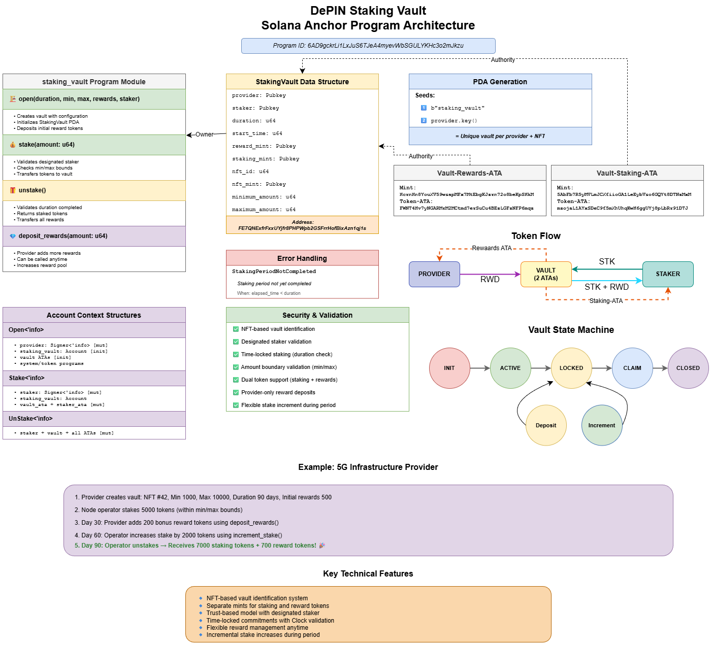

# DePIN Staking Vault

A Solana program for managing staking vaults where DePIN (Decentralized Physical Infrastructure Network) providers can create staking opportunities with predefined stakers. This program enables secure token staking with configurable durations and amounts, along with reward distribution mechanisms.

## Overview

The DePIN Staking Vault program facilitates a trust-based staking mechanism where:

## ✨ Features

🏛️ **Vault Management**

- Custom vault creation with configurable parameters
- Minimum and maximum staking limits
- Flexible staking duration settings

🔒 **Staking Operations**

- Secure token staking mechanism
- Ability to increase stake during active period
- Real-time stake amount tracking

💰 **Reward System**

- Initial reward deposit capability
- Dynamic reward addition during staking period
- Automatic reward distribution upon unstaking

## 🎯 Use Cases

### 📡 Telecommunications Infrastructure

- **5G Node Operation**: Telecom providers can use vaults to onboard trusted node operators. Operators stake tokens as commitment, receive rewards for uptime and service quality.
- **Rural Internet Expansion**: Communities can create vaults for local ISP infrastructure deployment, with residents staking to support expansion while earning rewards from service fees.

### 🌿 Environmental Projects

- **Carbon Offset Verification**: Environmental agencies can create vaults for carbon credit verifiers, where staking ensures honest reporting and rewards come from verification fees.
- **Renewable Energy Grid**: Solar/wind farm operators stake to participate in power distribution networks, earning rewards from energy supply.

### 🏗️ Smart City Infrastructure

- **IoT Sensor Networks**: Cities can onboard sensor network operators through staking vaults, distributing rewards based on data quality and uptime.
- **EV Charging Network**: Charging station operators stake to join the network, earning rewards from charging fees while ensuring service reliability.

### 🌐 Decentralized Computing

- **Edge Computing Nodes**: Cloud service providers can use vaults to manage edge computing node operators, with staking ensuring compute resource availability.
- **Data Storage Solutions**: Decentralized storage providers stake to offer storage services, earning rewards from storage fees.

### 🚗 Mobility Networks

- **EV Fleet Management**: Fleet operators stake to participate in electric vehicle networks, earning from vehicle utilization.
- **Charging Infrastructure**: Station operators stake tokens to join charging networks, receiving rewards from charging fees.

Each use case leverages the core features of:

- 🔒 Trust-based staking
- ⚖️ Configurable parameters
- 💎 Reward distribution
- ⏱️ Time-locked commitments
- 🤝 Designated participant system

## Architecture


**Technical Details**



## User Stories

### Provider Stories

1. **Vault Creation**

   - As a DePIN provider, I want to create a customized staking vault, so that I can establish staking requirements for my infrastructure.
   - As a provider, I want to set minimum and maximum staking amounts, so that I can ensure appropriate participation levels.
   - As a provider, I want to specify the staking duration, so that I can guarantee long-term commitment from stakers.

2. **Reward Management**
   - As a provider, I want to deposit initial rewards when creating the vault, so that I can incentivize stakers.
   - As a provider, I want to add more rewards to the vault at any time, so that I can adjust incentives based on performance.
   - As a provider, I want to designate specific stakers, so that I can ensure trusted participants in my infrastructure.

### Staker Stories

1. **Staking Operations**

   - As a designated staker, I want to stake tokens within the defined limits, so that I can participate in the DePIN infrastructure.
   - As a staker, I want to increase my staked amount during the staking period, so that I can enhance my participation level.
   - As a staker, I want to view my current stake and vault configuration, so that I can make informed decisions.

2. **Rewards and Unstaking**
   - As a staker, I want to unstake my tokens after the staking period ends, so that I can reclaim my investment.
   - As a staker, I want to receive accumulated rewards upon unstaking, so that I can benefit from my participation.
   - As a staker, I want to verify the completion of the staking period, so that I can plan my unstaking action.

### Qucick Start

This is still in the development phase. To test the program locally, follow these steps:

1. **Build and Install**
   ```bash
   npm install && anchor build
   ```
2. **Start Local Solana Test Validator**
   ```bash
   anchor run localnet
   ```
3. **Deploy the Program**
   ```bash
   anchor deploy
   ```
4. **Open Vault**
   ```bash
   anchor run open
   ```
5. **Stake Tokens**
   ```bash
   anchor run stake
   ```

## Example Transactions

Devnet ProgramId - `6AD9gckrLi1LxJuS6TJeA4myevWbSGULYKHc3o2mJkzu`

1. **Create Vault Transaction**: Open Instruction to create vault with params : `3Qi1saUXRo7rDZUbML9LiJRAGwhQfKgnPYLb3kncx4pFn5MVmCBt8jWJiZTyUAtyQ2DxJuvoYtDEY3hVgKbGGbjt`
   
2. **Stake Tokens Transaction**: Stake Instruction to stake tokens into the vault : `2GpQCmobi5Cw63dkZrenSe777joVHtmqMK4zXevXrDb7sM8bapj8UHqzUkJTUeVuMZqJtTcsoF4Zy6dYwvcvfA73`
   
3. **Unstake Tokens Transaction**: Unstake Instruction to unstake tokens from the vault :
   `3HwWJnChdRHJMLG8b94sSVN6yg7WxqqbwgbobxfqkzB2ueFxKvEg4dpoupzwg9tTE1dghhvWDLBTrqQx6X23iT6W`
   
